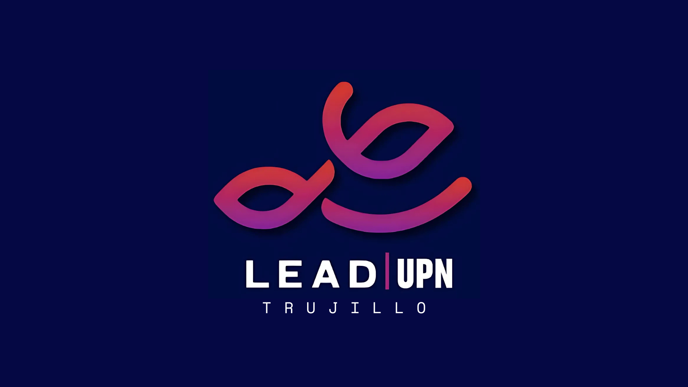

# Lead Upn Trujillo

_**(Lead Upn Trujillo)** es una organización de la Universidad Privada del Norte en la ciudad de Trujillo, fundada un **5 de noviembre de 1994 en Trujillo (campus El Molino, luego San Isidro en 2012)**._

_Acreditada nacional e internacionalmente (SINEACE, ABET, ICACIT), reconocida en rankings como QS, MERCO y Scimago._

_Teniendo a miles de estudiantes en pregrado y posgrado, con carreras en áreas de ingeniería, derecho, administración, psicología, comunicaciones y más, formando profesionales competitivos a nivel nacional e internacional._

<h2>
     Quienes somos
</h2>

Somos una organización estudiantil de **liderazgo con propósito** que promueve espacios de aprendizaje, acción y reflexión, integrando el desarrollo de competencias profesionales🎓, tecnológicas🧑‍💻, y personales👤, con el objetivo de **generar impacto** real dentro y fuera de la universidad.

<h2>
     Nuestra misión
</h2>

📈Impulsar el **desarrollo integral** de los estudiantes mediante espacios de aprendizaje, acción y reflexión que fortalezcan **competencias profesionales, tecnológicas** y de liderazgo con propósito💡, promoviendo una participación activa, ética y consciente.

<h2>
     Nuestra visión
</h2>

Formar a los estudiantes **líderes** con un perfil profesional de excelencia, fortaleciendo de manera integral sus **habilidades técnicas y blandas**. Aspiramos a impulsar jóvenes visionarios capaces de concebir y ejecutar proyectos de **tecnología** y **emprendimiento** con impacto **real** y **sostenible🌱**, que trasciendan fronteras y dejen huella a nivel nacional e internacional.

<h2>
     Pilares de especialización
</h2>

### 1. Desarrollo Profesional

- **Planificar, organizar y ejecutar las actividades** y eventos formativos📅.
- Brindar apoyo en la **coordinación logística📦**, comunidacion y seguimiento de eventos.
- **Representar a LEAD** UPN Trujillo con una conducta ética, respetuosa y comprometida en todo momento.

### 2. Impacto Comunitario

- Apoyar en la **identificación de problemáticas sociales** dentro de la comunidad local.
- Colaborar en acciones de educación, sensibilización y servicio dirigidas a distintos públicos👥.
- Apoyar en el **seguimiento y evaluación de las actividades** realizadas, contribuyendo a la reflexión y mejora continua.

### 3. Desarrollo De Capítulo

- Apoyar en los procesos de integración, inducción y acompañamiento de nuevos miembros. 
- **Diseñar y ejecutar actividades** internas que fortalezcan la cohesión, el sentido de pertenencia y la identidad institucional.
- Promover una **cultura de respeto, 🫂colaboración** y participación activa dentro del Capítulo.
- Trabajar de manera articulada con las demás áreas para fortalecer el **clima organizacional.**

### 4. Área De Marketing

- Estratega de Contenidos.
- Gestor de Redes & Comunidad.
- Productor de Contenidos.
- Diseñador & Editor de Contenido.

### 5. Alianzas y Convenios

- **Identificar🔍** emprendimientos, startups, marcas, organizaciones y profesionales que puedan conventirse en **aliados estratégicos** de **LEAD UPN.**
- **Proponer alianzas🤝** que generen beneficios para la comunidad estudiantil (descuentos, talleres, mentorías, eventos, experiencias, oportunidades laborales).
    
<h2>
     Proyectos
</h2>

Estos son algunos de los proyectos desarrollados por nuestra organización, enfocados en innovación tecnológica y desarrollo de soluciones para la comunidad.

- **[ScholarHub](https://www.instagram.com/leadupn_trujillo/p/DQdEi82jJmG/)** es un programa de becas nacional e internacionalmente.
- **[“El ADN del Éxito”. 🧬✨](https://www.instagram.com/leadupn_trujillo/p/DRScabCAZNZ/)** es un conversatorio de exitosos CEOS de empresas donde comparten experiencias, hábitos y decisiones que marcaron su camino profesional. 
- **[CORAZONES QUE SANAN](https://www.instagram.com/leadupn_trujillo/p/DUCH4f2gSos/)** es una campaña que promueve la adopción responsable de perros rescatados, ayudándolos a encontrar un hogar seguro y amoroso.

<h2>
     Conéctate con nosotros 
</h2>

    <a href="https://www.instagram.com/leadupn_trujillo?igsh=YnB0Mnc0eTBhZmN1">
         &nbsp;&nbsp;&nbsp;
    </a>
    <a href="https://www.linkedin.com/company/lead-upn-trujillo/">
         &nbsp;&nbsp;&nbsp;
    </a>

<h2>
     Licencia
</h2>

Type licence